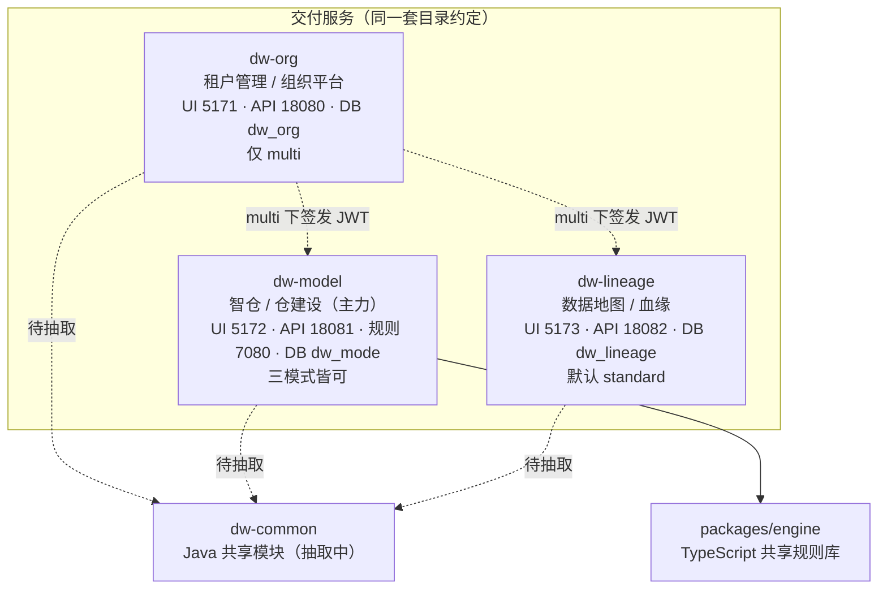

# 项目架构总览

> 数据仓库智能建设平台「智仓 DW-AI」。本文是面向开发者的整体架构速览：模块构成、拓扑、技术栈、运行模式、端口约定与本地环境。
> 更新于 2026-09-22。详细决策见 `adr/`，待办见 `pending-decisions.md`。

## 一句话定位

一套代码、三种运行模式，交付三套相互独立又可组合的服务（租户管理 / 智仓 / 数据地图），共享同一套规则引擎与公共 Java 模块。版本 `0.1.3`，正在迭代到 `0.2.0`。

## 模块构成

| 模块 | 职责 | 前端 | 后端 | 数据库 |
|---|---|---|---|---|
| `dw-org/` | 租户管理 / 组织平台 | 5171 | 18080 | dw_org |
| `dw-model/` | 智仓 / 仓建设（主力产品） | 5172 | 18081（规则 7080） | dw_mode |
| `dw-lineage/` | 数据地图 / 血缘 | 5173 | 18082（独立默认 8080） | dw_lineage |
| `packages/engine/` | TypeScript 共享规则库（不单独启动） | — | — | — |
| `dw-common/` | Java 共享模块（抽取中） | — | — | — |

每个已交付服务沿用同一套目录约定：前端 `ui/`、后端 `api/`、打包脚本 `packaging/`。

## 架构拓扑



- 三服务目前 Maven 互不引用，真正的共享下沉到 `dw-common` 后再按依赖顺序排列（见根 `pom.xml` 聚合说明）。
- multi 模式下，组织平台签发 JWT，仓建设 / 数据地图复用该令牌（ADR-0011），并受服务间 `MODULE_TOKEN` 门禁约束（ADR-0012）。
  这枚令牌是**组合部署的必需项**（三处同值）：模块的租户与项目靠它从组织同步过来，漏配的表现是
  「组织里建了项目，模块里看不见」。三种部署方式各自配在哪，见根 `README` 的「三种运行模式」。

## 技术栈

| 层 | 选型 | 版本 |
|---|---|---|
| 控制台 | Vue 3 + Vite + Ant Design Vue | 三个都用 npm workspaces（lineage 2026-09 由 pnpm 迁入，见 ADR-0014） |
| API | Java · Spring Boot · MyBatis-Plus | 21 · 3.3 · 3.5 |
| 迁移 | Flyway | 10（`classpath:db/migration/{h2,mysql,postgresql}`，H2 与 MySQL 共用） |
| 库 | H2（默认，分文件）· MySQL 8 · PostgreSQL 16 | org `dw_org` / `data/dw_org`；model `dw_mode` / `data/dw_mode` |
| 登录 | Casdoor OIDC（授权码 + PKCE） | 可选；未配时用开发 JWT |
| 规则 | Node（`dw-model/rules`） | 后接，非阶段必开 |

本阶段明确不做：StarRocks、DolphinScheduler、用 Java 重写引擎。

## 三种运行模式

同一套代码，启动时用环境变量选一种，**运行中不要改**。

| 模式 | 配置值 | 谁管登录 | 组织平台 | 典型用法 |
|---|---|---|---|---|
| 独立 | `standalone` | 不管人，无登录 | 不启 | 只跑仓建设或血缘 |
| 普通 | `standard` | 本模块本地账号 | 不启 | 单企业自用仓建设 / 血缘 |
| 多租户 | `multi`（仓建设/血缘默认；组织唯一模式） | 组织平台 | **必须先起** | 套件：先登录组织，再进仓建设 / 血缘 |

- 组织平台**只有 multi**（它的业务就是管租户）。仓建设、血缘三种都能跑。
- 独立 / 普通下各产品只显示自己的页面：仓建设 `/model…`，数据地图 `/lineage…`，组织 `/org…`。
- 后端开关：三个模块统一用 `DW_AI_MODE`（组织平台恒为 multi，设了也不变）；血缘另有更具体的 `LINEAGE_RUN_MODE`，两个都设时以它为准，也可用 Spring profile（如 `application-multi.yml`）。
- 前端会调 `/api/auth/config` 跟上模式；为避免第一屏闪错模式，可同时设 `VITE_RUN_MODE`。

multi 模式当前有两层门禁（顺序不能混）：

```
身份（组织 JWT）    → 没令牌 401，Security 层
租户上下文（请求头）→ 有令牌但头不对 400，TenantInterceptor
```

`/api/runtime` 是唯一豁免：前端要先知道模式，才知道该不该去取令牌，否则是循环依赖。

## 端口约定

> 2026-09-22 更新：`dw-lineage` 前端端口由 5175 统一改为 **5173**（multi / standard / standalone 一致）。

| 服务 | 前端 | 后端 | 规则 | 库 |
|---|---|---|---|---|
| dw-org | 5171 | 18080 | — | dw_org |
| dw-model | 5172 | 18081 | 7080 | dw_mode |
| dw-lineage | **5173** | 18082（独立默认 8080） | — | dw_lineage |

### 本次端口变更涉及的文件

- `dw-lineage/ui/package.json`：`dev:multi` 的 `VITE_DEV_PORT` 与 `vite --port` 改为 5173（`dev:standalone` / `dev:standard` 本就是 5173）。
- `dw-lineage/api/src/main/resources/application-multi.yml`：`lineage.public-base-url` 默认值改为 `http://127.0.0.1:5173`。
- `dw-model/ui` 与 `dw-org/ui`：嵌入 lineage 的 iframe origin（`src/config/product.ts` fallback、`package.json` 的 `VITE_LINEAGE_ORIGIN`、`README` 环境变量表）同步改为 5173。
- `README.md`（根与 `dw-lineage/`）：端口说明同步。
- `vite.config.ts` 中 `server.port` 默认本就是 5173（`Number(process.env.VITE_DEV_PORT) || 5173`），无需改动。
- `application.yml` 的 CORS `allowed-origins` 已含 5173（5175 保留为宽松白名单，无害）。

### 已知差异（不阻塞，留待 0.2.0 落地统一）

- `docs/product/versions/0.2.0/` 下的**交互原型**仍用 5175 作为「数据地图原型」端口（`run-proto.mjs`、`prototype/`、`org/`、`spec/`、`README`、`RELEASE`、`PRD`）。这是 0.2.0 设计版的独立展示端口约定，与实服务端口是两套体系，原型启动（`npm run proto`）与 dev 服务不会同时占用。后续 0.2.0 落地时统一对齐到 5173。
- `docs/tech/07-0.2.0.md` 中数据地图端口仍记为 5175，同上，待 0.2.0 落地统一。

## 本地开发环境

> 更正：此前部分记录称「本机无 mvn / 无 JDK」，那是针对沙箱/IDE 内置运行环境的描述，不代表用户实际机器。本机实际具备完整的 JDK 与 Maven。

| 工具 | 要求 | 本机实际情况 |
|---|---|---|
| JDK | 21（Spring Boot 3.3） | `/Users/wang/Downloads/tools/jdk-21.0.2.jdk/Contents/Home`（`JAVA_HOME`） |
| Maven | 3.9.x | `/Users/wang/Downloads/tools/apache-maven-3.9.16`（`MAVEN_HOME`），`mvn -v` 显示 Java 21.0.2 |
| Node | 22.13+（下限来自 pnpm 时期，迁 npm 后保留未动） | 见各前端 `engines` |
| Docker | 可选（Compose 部署） | 本机已装 |

本机另有 JDK 17 / 11 / 9 / 8（`/Users/wang/Downloads/tools/` 下），按需切换 `JAVA_HOME`。**编译后端统一用 JDK 21**。

环境校验：

```bash
echo "$JAVA_HOME"          # /Users/wang/Downloads/tools/jdk-21.0.2.jdk/Contents/Home
echo "$MAVEN_HOME"         # /Users/wang/Downloads/tools/apache-maven-3.9.16
mvn -v                     # Apache Maven 3.9.16, Java 21.0.2
```

> 沙箱注意：在受限沙箱里跑 `mvn` 编译 / 测试时，`target/` 写入可能被拦截，需要放行；沙箱 PATH 也可能不含 `mvn` / `java`，需用绝对路径或放行。这与「本机是否有 JDK/Maven」是两回事。

## 快速启动

详见根 [README.md](../../README.md)。多租户 multi（默认套件）：

```bash
npm install            # 仓库根
npm run dev:api:org     # 组织 API 18080
npm run dev:org         # 组织前端 5171
npm run dev:api:model   # 仓建设 API 18081
npm run dev:model       # 仓建设前端 5172
npm run dev:api:lineage # 血缘 API 18082（profile=multi）
npm run dev:lineage     # 血缘前端 5173
```

## 交付方式

| 方式 | 命令 | 产物 |
|---|---|---|
| 完整安装包（Java 出页面） | `./dw-org/package.sh` / `./dw-model/package.sh` | `*-0.1.3.tar.gz` |
| 只打后端 | `./dw-org/package.sh api` | `*-0.1.3-api.tar.gz` |
| 只打前端 | `./dw-org/package.sh ui` | `*-0.1.3-ui.tar.gz` |
| Compose（单服务） | `docker compose -f dw-org/docker-compose.yml up -d --build` | `org-api` + `org-ui` |
| Compose（全套） | `docker compose up -d --build` | 两套 API + 两套 Nginx |

安装包改模式：`conf/env.sh` 里的 `DW_AI_MODE`（三个模块统一）；血缘另有 `LINEAGE_RUN_MODE`，两个都设时以它为准。

## 相关文档

- 根 [README.md](../../README.md)：运行模式与启动命令
- [00-stack.md](./00-stack.md)：技术栈底座
- [overview.md](./overview.md)：优化进展总览
- [pending-decisions.md](./pending-decisions.md)：待决策事项清单
- `adr/`：架构决策记录
