# 智仓产品手册

登录之后怎么用：三套界面、角色、工作台、规范中心、建模中心、平台管理。安装、换库、灌演示数据、升级见 **[使用说明](./使用说明.md)**。

当前控制台交付：**规范中心**、**建模中心**，以及登录 / 租户工作台 / 平台管理。开发中心、沉淀优化、数据服务尚未上线，侧栏不会出现。

截图在 [images/](./images/)，用控制台实拍。本机 UI（5173）和 API（8080）起来后，可在 `ui/` 下重拍：

```bash
node scripts/capture-user-docs.mjs
```

---

## 1. 账号

登录页不列出账号。演示环境见下表（安装包须先 `./bin/seed.sh` 才有张三 / 李四）。

| 用户名 | 密码 | 用途 |
|---|---|---|
| `admin` | `admin123` | 平台用户（仅多租户）。开通租户、管平台用户。进已有租户仍须授权码 |
| `张三` | `123456` | 星河租户管理员；交易数仓项目管理员 |
| `李四` | `123456` | 星河建模工程师；启航租户管理员 |

种子授权码 `XINGHE-DEMO` 只在执行 seed 后存在。`DW_AI_MODE=standard` 时不要用 `admin` 登录。

---

## 2. 三套界面

| 界面 | 谁进 | 做什么 |
|---|---|---|
| **平台后台** | 平台用户（多租户） | 开停租户、勾选模块、管平台账号。不改编规范或模型 |
| **租户工作台** | 租户管理员 | 用户、项目、角色、知识库、设置、授权码。普通成员进不了这里 |
| **项目控制台** | 项目成员 | 规范中心、建模中心、项目成员、项目知识库 |

普通模式（`DW_AI_MODE=standard`）没有平台后台和「租户」字样。管理员进工作台，其他人进已加入的项目。

---

## 3. 登录

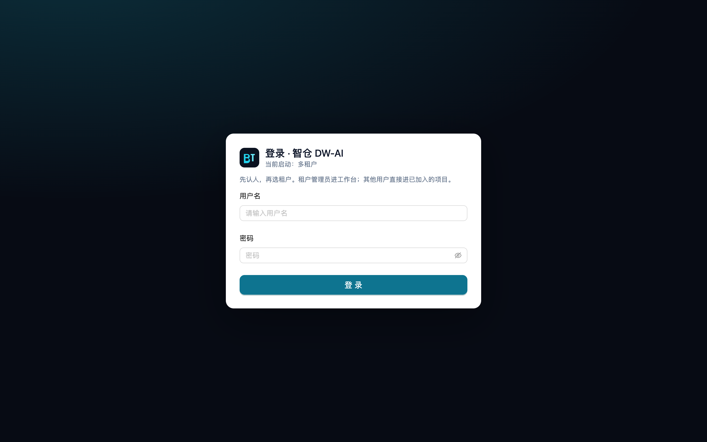

多租户：先认人，再选组织。租户管理员进工作台；其他人进已加入的项目。只有一个组织时会自动进入，多个组织停在选择页。

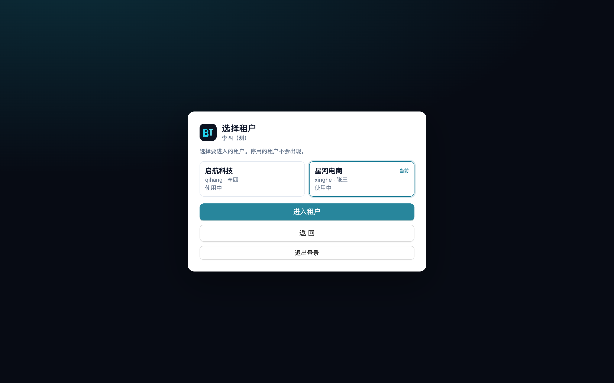

平台用户登录后进平台后台。要进某个租户，须当场输入该租户未作废、未过期的授权码，不会因为上次进过而跳过。

普通模式：用户名 + 密码通过后直达项目列表，没有选租户。

---

## 4. 租户工作台

仅租户管理员。侧栏在「系统管理」：用户、角色、项目、设置；另有知识库。进项目后这些入口不再出现。左下角（顶部菜单时在右上角）可改资料、改密码、切换租户。「返回工作台」只给租户管理员。

### 4.1 项目管理

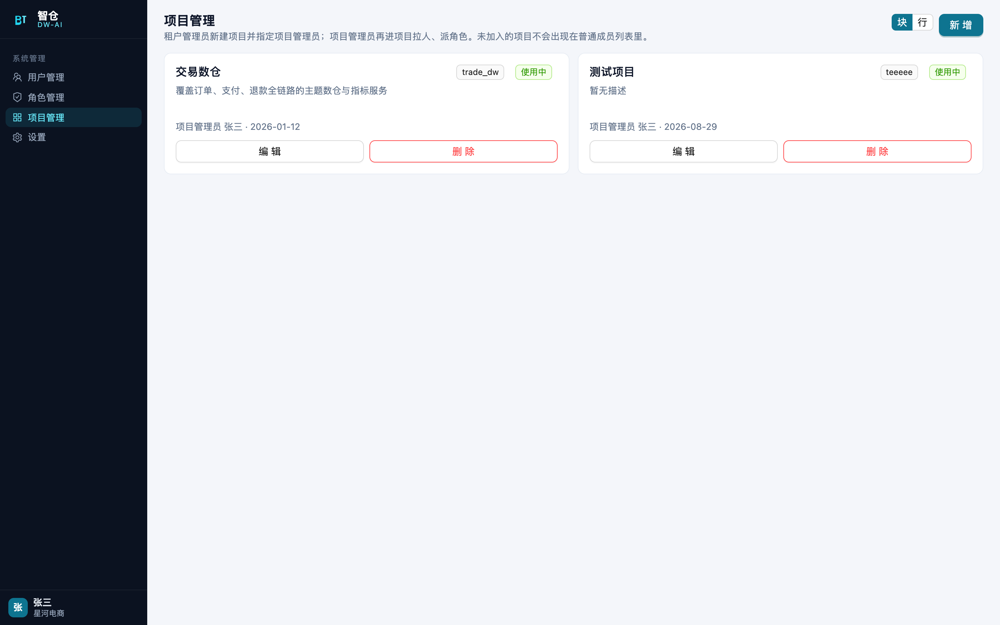

块 / 行可切换。卡片或行上：**进入项目**、**编辑**。名称、编码、说明、管理员、状态、知识库引擎、删除在编辑抽屉里。

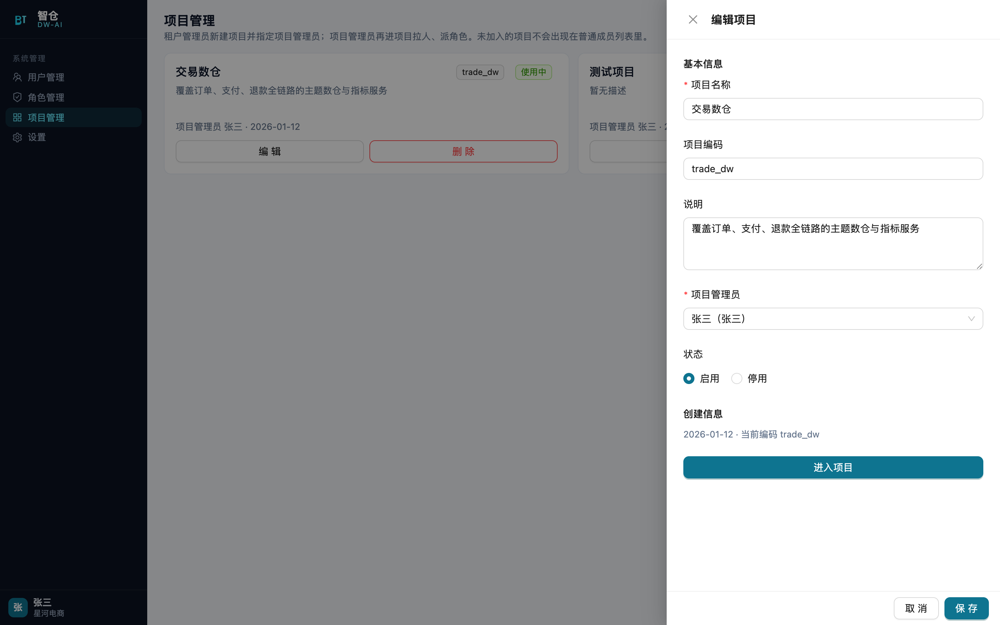

停用后不能进入；切换项目下拉不列出已停用项。删除在抽屉内，不在列表行上。

### 4.2 用户管理

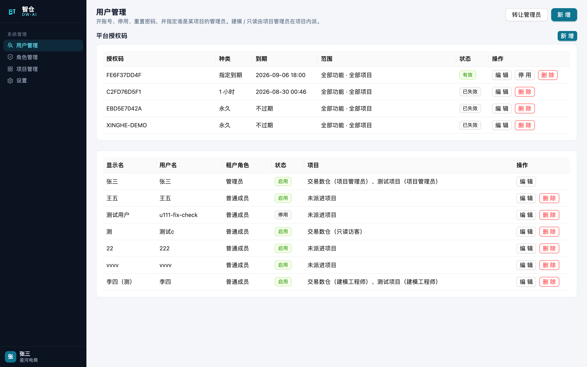

行上只有 **编辑 / 删除**。新建：当场开账号，或把已有账号拉进本组织。

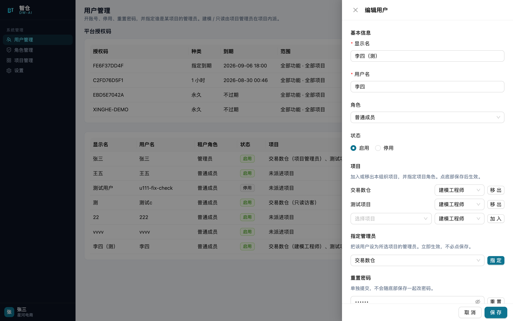

抽屉里改显示名、用户名、租户角色、状态、所在项目。**指定项目管理员**、**重置密码**即时生效。不能停用或删除自己。删除只是移出本组织，账号还在，可再拉入。

同页下方是 **平台授权码**：给平台用户进本租户用。


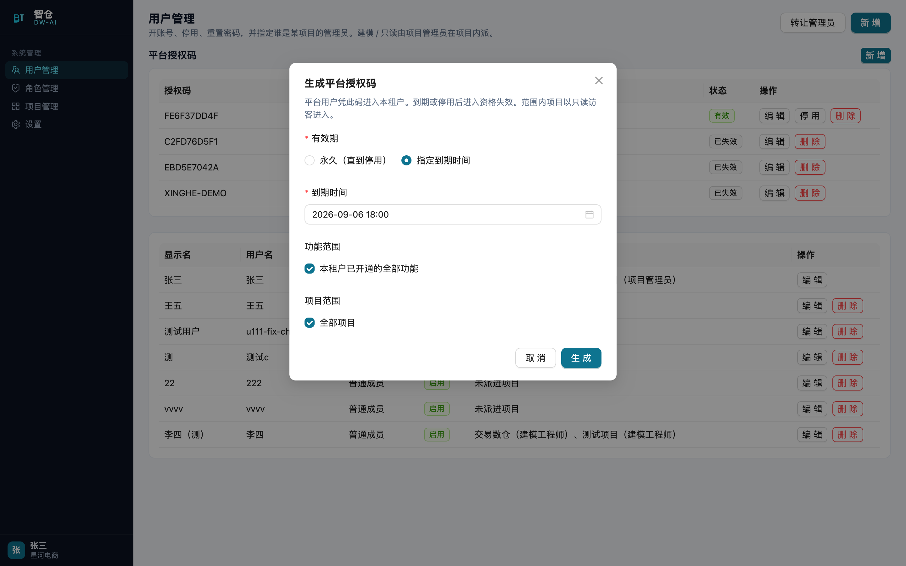

生成时可指定有效期、功能范围、项目与角色、AI 能力。空的 AI 勾选 = 不限制（取租户已开通）。持码进入后有效能力 = 租户仓建设许可 ∩ 本码勾选。

### 4.3 角色与设置

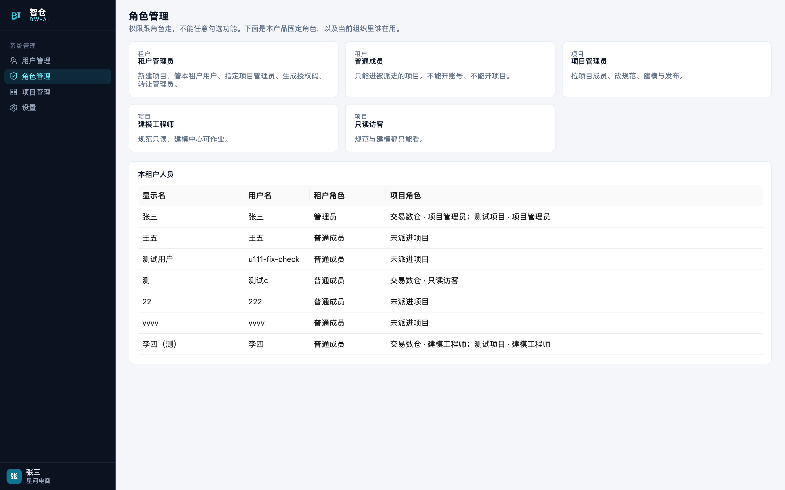

角色是固定的，不做任意勾选矩阵。本页展示角色说明和本组织人员。

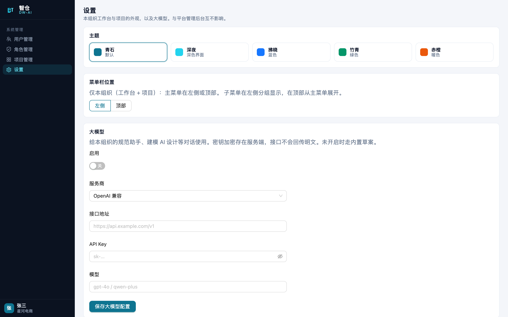

主题、菜单位置只作用于本租户工作台和项目，不影响平台后台。大模型通道：填地址、模型、密钥（密钥不回传）。其下是三个 **AI 提示词**槽位（规范设计 / 规范问答 / 建模），可改、可恢复默认。未开大模型时对话走内置草案，不读这些槽位。

### 4.4 知识库

工作台按项目勾选引擎（Hive / Spark / ClickHouse / Doris）。内置建表、改表、分区手册；租户管理员可按模版导入补充篇。项目内「知识库」只读已开通的引擎。

---

## 5. 进项目

项目管理员从工作台点「进入项目」，或抽屉里「进入项目」。落地在概况。

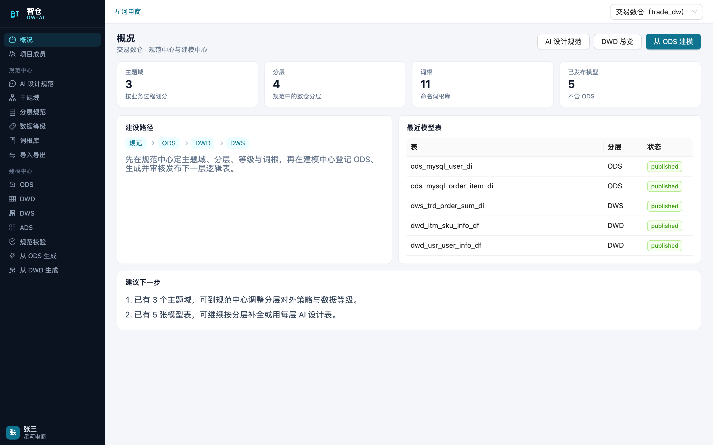

顶栏可切换本组织其它未停用项目。概况展示主题域 / 分层 / 词根 / 已发布表数量，以及建议下一步。

侧栏（仓建设已开时）：

| 组 | 页 |
|---|---|
| — | 概况、项目成员、知识库 |
| 规范中心 | AI 设计规范、主题域、分层规范、数据等级、词根库、加工类型、导入导出 |
| 建模中心 | 各分层总览、规范校验、从 ODS 生成、从 DWD 生成 |

未开通仓建设时规范 / 建模整组不出现。无某项 AI 能力时，对应入口仍可见但禁用，文案「本组织未开通此项」。普通模式三项默认开，不出现这条。

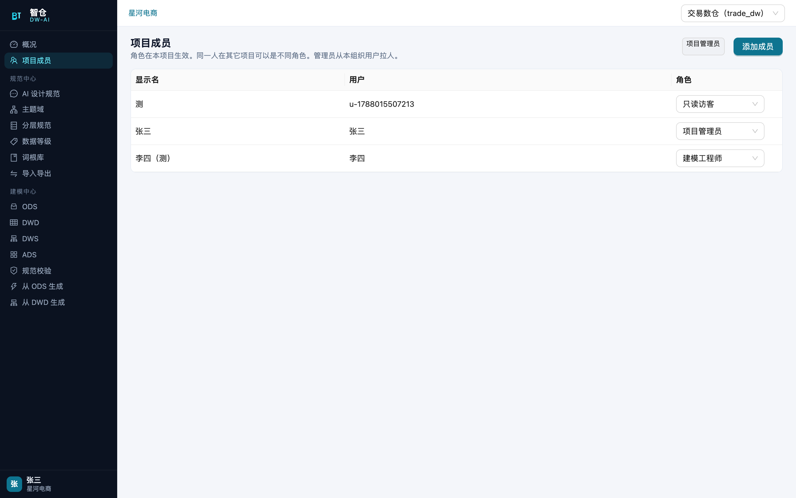

项目管理员把**本组织已有用户**拉进本项目并派角色。不能在这里开新账号。

---

## 6. 规范中心

**只有项目管理员能改规范。** 建模工程师和只读访客只能看（可走规范问答）。

建议顺序：主题域 → 分层 → 数据等级 → 词根 →（可选）AI 补全或导入。

### 6.1 主题域、分层、等级、词根

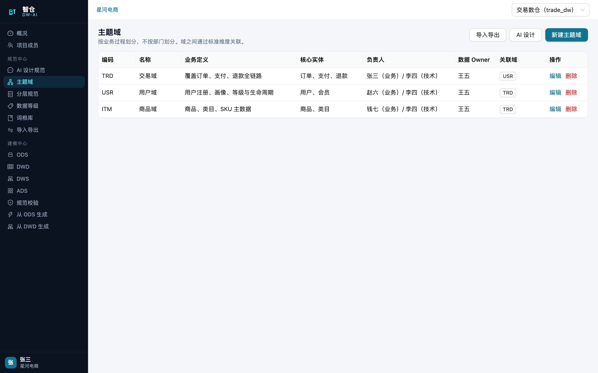

主题域：编码、名称、定义、责任人。表要归属主题域。

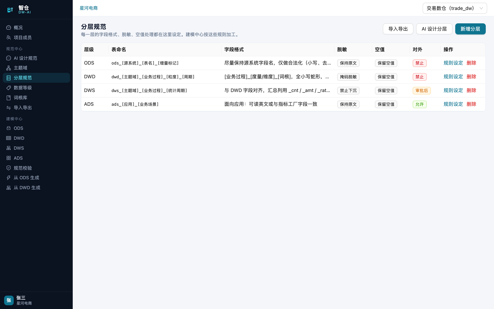

每一层的命名、留存、对外服务、字段格式、脱敏、空值处理。建模生成下一层时套这些规则。页上可跳到「五种加工类型」。

数据等级：查询 / 导出策略，表和字段可选用。词根：业务 / 技术 / 时间，用于命名建议和校验。

### 6.2 加工类型

五种分类由产品写死，**本页不能增删改**。只解释透传、转换、聚合、派生、常量分别何时用。某张表某列怎么算，写在建模中心字段上。

### 6.3 AI 设计规范

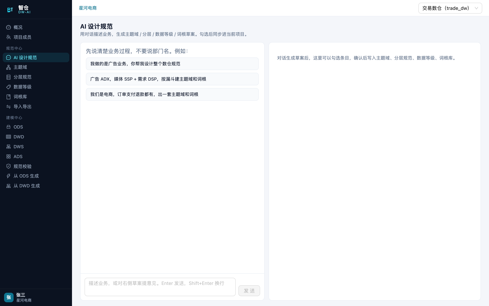

开通「规范设计」且有写规范权限：对话后出草案，勾选再同步到主题域 / 分层 / 等级 / 词根。默认增量补全；覆盖须勾选「覆盖已有编码」。

只有「规范问答」或没有写权限：只出文字，没有同步按钮。

对话会带上本项目已有规范摘要。未开大模型时走内置草案。

### 6.4 导入导出

把规范打成包导出，或从文件导入。覆盖导入会替换已有编码，操作前先看清提示。

---

## 7. 建模中心

逻辑表按分层看。演示数据在「交易数仓」：ODS 订单项 / 用户 → DWD 明细 → DWS 日汇总。

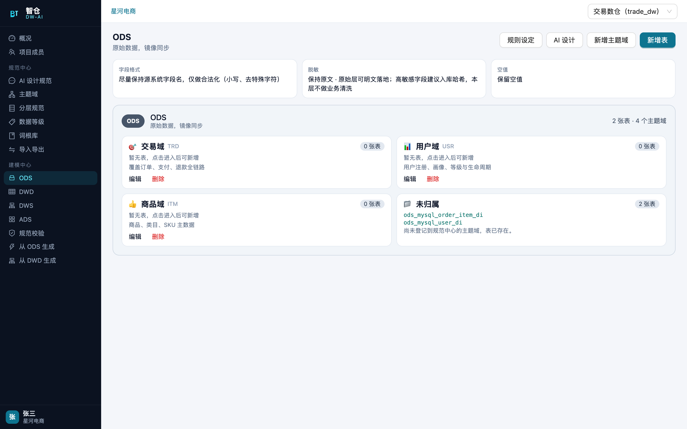

### 7.1 建议路径

1. 规范就绪（至少分层、主题域、词根）。
2. 登记或查看 ODS。
3. 「从 ODS 生成」出 DWD 草案，审核通过并发布；或手工新建 / 编辑表。
4. 「从 DWD 生成」出 DWS 草案（可多选源表），审核发布。
5. 各层也可用「AI 设计表」对话后勾选写入。

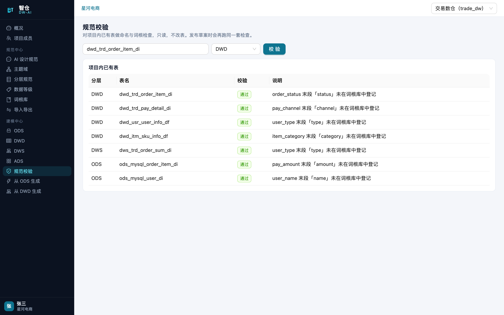

对项目内表跑命名与词根检查，只读。发布草案时也会跑同一套；有规范**错误**不能发布。本页不检查加工是否写全。

### 7.2 表：草稿与发布

- **保存**（手工新建 / 编辑、AI 采纳、从历史写回）→ 状态为**草稿**，不记版本。
- **发布**（表明细上，须「发布模型」权限）→ 状态为已发布，结构有变化才记一版，可填备注。
- 项目管理员可发布；建模工程师默认可写、不能发布（除非另行授予）。

保存已有表时，若改了被下游引用的字段（改名、改类型、删除、改口径、改粒度或关联），会列出影响的下游表和字段。确认后**只写本表**，不自动改下游。

### 7.3 字段加工与逻辑 SQL

编辑表时可声明：

- **来源表**（0～多张，带别名）和 **关联**（等值键，内连接 / 左连接）
- 每个字段的 **加工类型 + 口径 + 表达式**（透传 / 转换 / 聚合 / 派生 / 常量）

未写加工可以保存，字段标「尚未定义」。演示里支付明细故意没有加工，这是合法状态。日汇总的 `pay_user_cnt` 等列有完整加工，可用来看 SQL。

表明细底栏同一块可切：

| 页签 | 内容 |
|---|---|
| 逻辑 SQL | **建表 DDL**（Hive / Doris / MySQL）或 **加工 DML**（一份 INSERT SELECT，不按方言拆、不执行） |
| 血缘 | 上游表 → 本表 → 下游表；字段级上游列 / 下游表.字段。点表可跳转 |
| 下游影响 | 草稿相对上一发布版，可能影响到的下游表字段 |

点字段名打开抽屉：口径、类型（链到规范中心说明）、上游列、下游引用、该列查询 SQL（可复制）。未定义加工时无法生成 SQL。

### 7.4 从 ODS / DWD 生成

- **从 ODS 生成**：选一张 ODS，生成 DWD 草案。审核通过并发布时，把脱敏 / 时间 / 空值处理写入字段加工，来源指向该 ODS。
- **从 DWD 生成**：可多选 DWD，选维度并生成度量（聚合、可选过滤，可有派生）。发布后 DWS 带上来源、关联和字段加工。分层策略禁止下沉的个人身份维度会报错，不能发布。

两步都要勾完人工审核点，且规范错误须先消掉。

### 7.5 表版本

表明细进「版本」。列出已发布版本号、备注、操作人、时间。对比两版看属性差、字段增删改，以及一份**结构变化语句**（添加 / 修改 / 删除字段的逻辑 DDL，不执行）。

「切换为当前」把历史结构写回本表，变为**草稿**，再发布才记新版本。写回前同样列出下游影响。历史记录不删、不改写。

### 7.6 每层 AI 设计表

开通「建模 AI」：对话带本层规则、已有表名、当前规范。须「写模型」才能确认写入。写入为草稿，改已有表前会展示影响清单。无能力时入口禁用。

---

## 8. 平台后台（仅多租户）

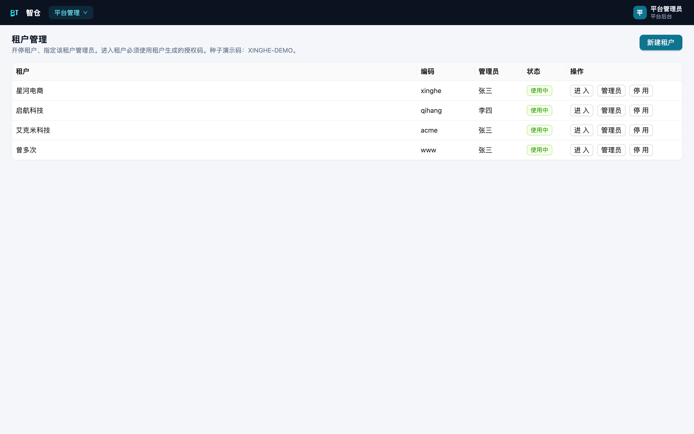

平台用户看全部租户（含停用）。创建：编码、名称、开通模块、指定或新建该租户第一位管理员。勾选仓建设则三项 AI 自动全开，**页上不勾 AI**。编辑可改名称、模块、管理员。点「进入」必须当场输授权码。

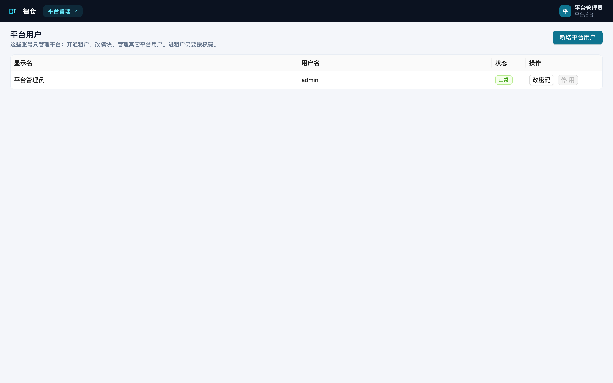

新建平台账号（用户名全局唯一 + 初始密码）、改密、停用。不能停用自己，也不能停用最后一个可用的平台用户。

平台设置里的主题 / 菜单**只作用于平台后台**，不会带到租户工作台或项目。

平台用户不能在后台改编规范或模型。

---

## 9. 谁能改什么

| 动作 | 谁 |
|---|---|
| 开租户、管平台用户 | 平台用户 |
| 开项目、管本组织用户、授权码、工作台设置 / 知识库导入 | 租户管理员 |
| 改规范、拉项目成员 | 项目管理员 |
| 建改表、写加工、生成草案、AI 写入、恢复历史为草稿 | 写模型（项目管理员、建模工程师） |
| 发布表、审核通过并发布生成草案 | 发布模型（默认项目管理员） |
| 只看规范 / 模型 | 只读访客；建模工程师看规范只读 |

同一人可以在 A 组织当管理员、在 B 组织当普通成员。

---

## 10. 本版控制台没有

- 指标工厂、调度执行、质量巡检跑数
- 跨项目血缘、自动改下游表
- 加工 DML 按引擎出三套或真执行
- 平台模型目录、通用后台 Chat
- 登录页自助开租户、任意勾选权限矩阵

安装与升级步骤仍看 [使用说明](./使用说明.md)。
